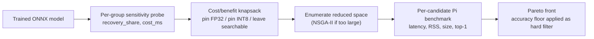

# EdgeTuner: A Deployment Optimizer for ARM Edge Devices

## What is EdgeTuner?
Quantization, layer precision, runtime settings — every one of these choices trades speed against
size against memory against accuracy, and the trade-offs are hardware-specific. This makes it overwhelmingly complicated to pick one single configuration for our model.

That is why we build EdgeTuner. EdgeTuner finds the optimal combination for you: it searches those settings automatically, measures every candidate on a real Raspberry Pi 5, and
hands you a shortlist of configurations — fastest, smallest, most accurate, or balanced — so you can pick the one that fits what you're building, backed by real measurements instead of a guess.

---

## How it works

1. **Per-group sensitivity analysis.** Every layer group (not layer — the model is graphed and
   grouped by module path) is quantized to INT8 in isolation and scored for accuracy loss.
   This produces two numbers per group: how much accuracy it costs to spare it as FP32
   (`recovery_share`), and, from a follow-up latency probe, how much it costs in milliseconds
   (`cost_ms`).

2. **Cost/benefit reduction, not a heuristic cutoff.** The groups are treated as a knapsack over
   `recovery_share / cost_ms` — the accuracy bought per millisecond spent. A group is pinned FP32
   if it's worth its cost outright, pinned INT8 if it buys nothing, and left **searchable** only
   if its cost falls inside a measured reproducibility band (by default 2% of a reference latency,
   or the sentinel-measured spread when one's been run) — i.e., only when the device's own
   measurement noise can't tell its cost apart from zero. That band is what keeps a lucky
   measurement from being pinned as fact.

3. **Enumeration over NSGA-II, when it fits.** The reduced space is walked one factor at a time
   off a canonical recipe (static per-channel UINT8, MinMax/512, `all` graph optimization, arena
   on) — precision vector, then per-channel, then activation type, then optimization level, then
   calibration — covering every precision vector each round before moving to the next factor.
   NSGA-II only kicks in if `2^|searchable groups|` exceeds the trial budget; every bundled model
   reduces small enough that enumeration is the live path.

4. **Every candidate is measured, not estimated.** Each precision/runtime vector is exported,
   quantized, and benchmarked as one process on the Pi 5 — latency, peak RSS, artifact size,
   top-1 accuracy. Candidates below `baseline_top1 - accuracy_budget_pt` (default 1.0 points, set
   with `--budget-pt`) are rejected outright, a hard filter, not a soft objective.

5. **Pareto front, not a leaderboard.** Surviving candidates are ranked across the four measured
   objectives; the output is every configuration nothing else beats on all four at once, not one
   "winner." Surviving just means it cleared step 4's accuracy filter — the ranking itself has
   nothing to do with whether a candidate stays or goes.



## What you need before you start

**The device.** A Raspberry Pi 5 running **64-bit Raspberry Pi OS Bookworm**, with the official
27 W PSU and an active cooler. The PSU and cooler are not optional extras: an undervolted or
throttling Pi measures its own thermal state rather than your model, and the harness refuses to
record a run where that happened.

**The host.** Any machine with Python 3.11 and an SSH client. It never needs a GPU unless you
intend to train a model from scratch.

**The model.** A **CIFAR-100 classifier**, exported to ONNX with:

| Requirement | Why |
| --- | --- |
| Static `(1, 3, 32, 32)` input | Dynamic axes break static INT8 calibration and invalidate the latency method |
| 100 output classes | The evaluation bundles are CIFAR-100 |
| Exported by `torch.onnx.export` | Node names must carry module paths, or per-block sensitivity has nothing to group by |

The importer checks all three and refuses with a reason rather than producing a meaningless
ranking. **224x224 models are rejected** — the evaluation bundle is 32x32 uint8 pixels, and
resizing at evaluation time in a way that differs from training is a well-known silent accuracy
killer.

## How to run it on a Raspberry Pi

### 1. Set up the host — about 10 minutes

```bash
git clone https://github.com/Misreal/ARM_challenge.git
cd ARM_challenge
pip install -r requirements.txt
pytest
```

Five failures in `tests/test_sensitivity_answer_key.py` are expected. They are a recorded
disagreement between a planted answer key and what the device actually measured, kept deliberately
rather than edited away.

### 2. Set up the Pi — about 30–45 minutes, once per device

Follow [`docs/raspberry-pi_setup.md`](docs/raspberry-pi_setup.md), **Sections 1 through 5**:

| Section | What it does |
| --- | --- |
| §1 | Network and first SSH login |
| §2 | System update and base tools |
| §3 | Create the `~/armopt` virtual environment |
| §4 | Install `requirements-pi.txt` — pinned, and deliberately torch-free |
| §5 | Verify ONNX Runtime imports and reports the right version |

§6 covers benchmark hygiene. Read it. It is what separates a measurement from a number.

The ONNX Runtime version on the Pi must match the host exactly. Different kernels shift both
accuracy and latency, so a mismatch quietly compares two different things.

### 3. Connect the two — about 5 minutes

Set up SSH key authentication (§12), then copy the template and fill in **your own** device:

```bash
cp pi_target.example.json pi_target.json
```

Every value in the template is a placeholder that must be replaced:

| Field | What to put | Required |
| --- | --- | --- |
| `host` | Your Pi's IP address or hostname | yes |
| `user` | Your username **on the Pi**, not on your laptop | yes |
| `remote_root` | Where this repo lives on the Pi, e.g. `/home/<you>/arm_challenge` | yes |
| `python` | The **venv** interpreter from §3, e.g. `/home/<you>/armopt/bin/python` | recommended |
| `port` | SSH port; leave `22` unless you changed it | no |
| `identity_file` | Path to a specific private key, or `null` for your SSH default | no |

`python` matters more than it looks. It must point at the `~/armopt` venv, **not** the Pi's system
`python3` — §5 of the setup guide has you verify exactly this. The system interpreter either lacks
ONNX Runtime entirely or carries a different version, and a version mismatch between host and
device silently compares two different things.

`pi_target.json` is gitignored, so it never arrives with a clone and your host details never get
committed. The template is the only version in the repository. If you would rather not write a file
at all, `ARMOPT_PI_HOST`, `ARMOPT_PI_USER`, `ARMOPT_PI_ROOT`, `ARMOPT_PI_PYTHON` and
`ARMOPT_PI_KEY` override it from the environment.

Confirm the link before spending device time on anything:

```bash
python -m src.bench.remote --push-code --check
```

That reports the governor, clock, temperature and throttle mask. If it passes, the host can drive
the Pi.

### 4. Build the evaluation bundles — about 5 minutes

Required once, whichever model you bring. The bundles are gitignored because they are derived data.

```bash
python -m src.data.splits --create      # downloads CIFAR-100 and writes the split
python -m src.data.export_pi_data       # optimization and calibration bundles
python -m src.data.export_test_bundle   # the sealed test bundle
```

The split is three-way and strictly separated: the search never sees the test set, and calibration
never sees the data the search is scored on.

### 5. Bring in a model

**Have a PyTorch checkpoint, not ONNX yet?** Export it first with a static `(1, 3, 32, 32)` input
and the legacy exporter — `dynamo=False` is what keeps node names carrying module paths, which is
what per-block sensitivity groups on:

```python
torch.onnx.export(
    model.cpu().eval(), torch.zeros(1, 3, 32, 32),
    "your_model.onnx", input_names=["images"], output_names=["logits"],
    opset_version=17, dynamo=False,
)
```

Then import the ONNX file:

```bash
python -m src.import_onnx --onnx your_model.onnx --name your_model --seal-test
```

Needs: CIFAR-100, static `(1, 3, 32, 32)` input, exported by `torch.onnx.export`. The importer
checks and tells you if it doesn't qualify. Use a name that isn't already taken — re-importing
under an existing name is blocked so the sealed test score can't be scored twice.

Want the three models these results were measured on instead? They're on the
[v1.0 release](https://github.com/Misreal/ARM_challenge/releases/tag/v1.0):

```bash
curl -L -O https://github.com/Misreal/ARM_challenge/releases/download/v1.0/resnet18_cifar.onnx
python -m src.import_onnx --onnx resnet18_cifar.onnx --name resnet18_repro --seal-test
```

Swap in `mobilenetv2_cifar.onnx` or `custom_cnn.onnx` for the other two.

### 6. Run the campaign

```bash
sudo bash scripts/pi_prepare.sh        # on the Pi, after every boot
python -m src.app run --model your_model
```

`pi_prepare.sh` pins the CPU governor. It needs `sudo`, so it cannot be done for you from the host,
and the harness refuses to measure a device whose governor is unpinned.

Stages are skipped if already done, so an interrupted overnight campaign resumes where it stopped.
`--only <stage>` reruns one stage; `--force` redoes work.

### 7. Read the results

```bash
python -m src.app list          # every run and whether it has a page
```

Open `runs/<run_id>/dashboard/index.html` for that campaign, or
`artifacts/dashboard/index.html` for the landing page listing all of them. Both are rebuilt
automatically at the end of a run.

## How it works

Twelve stages, declared as data in [`src/pipeline.py`](src/pipeline.py):

| Stage | What it does |
| --- | --- |
| `baseline` | Validate the graph, freeze its FP32 accuracy |
| `quant_baselines` | Score fp32, dynamic INT8, and both static INT8 recipes |
| `sensitivity` | Probe how much damage quantizing each block does |
| `group_cost` | Measure what excluding each block costs in latency |
| `cost_benefit` | Join each block's benefit to its price |
| `sentinel` | Repeat one config to measure the device's own noise floor |
| `search_space` | Pin the blocks whose price the noise floor cannot resolve, keep the rest |
| `study` | Sensitivity-constrained hybrid search, measured on the device |
| `finalists` | Re-measure the shortlist five times and name the deployment choices |
| `final_test` | Score the front once on the sealed test set |
| `dashboard` | Render that run's page |
| `index` | Refresh the landing page that lists every run |

**Sensitivity analysis before search** is the part that distinguishes this from running global INT8
quantization. Rather than quantizing everything or hand-picking the usual first and last layers, it
measures which blocks actually suffer, prices each exclusion in milliseconds on the device, and
searches only where the trade is real.

**The search is hybrid, and usually exhaustive.** Once the reduction has pinned the blocks whose
price is settled, what is left is small — 8 to 16 precision vectors on the bundled models. The
planner enumerates that space exactly, one factor at a time off a canonical recipe, so each round
reads as *what does this one knob buy*. Only a space too large to enumerate falls back to a
constrained NSGA-II, which no model bundled here reaches.

### What "measured" means here

- **Latency, memory and size come from the device.** Never from FLOPs or parameter counts. A
  candidate is measured in its own process so peak RSS is attributable, with the CPU governor
  pinned, a temperature gate before each timed section, and any run flagged invalid if the Pi
  throttled during it.
- **The test set is scored once, after the search has finished choosing.** Training, optimization
  and calibration each use a separate split of the training data. Nothing about the search ever
  reads the test set, because repeatedly querying it to steer optimization is how a headline number
  becomes meaningless.
- **Accuracy is a hard filter, not an objective to trade away.** Candidates below
  `baseline - budget` are rejected regardless of how fast they are.
- **Differences smaller than the measurement's own noise are called ties.** Repeating one identical
  configuration eight times over half an hour gave a 2.55% spread, so the page refuses to rank two
  candidates apart on less than that, and shows which of your priorities actually broke the tie.
  That band does more than format the page: it decides which block costs count as real, and a block
  whose price cannot be told from zero is searched rather than pinned. Guessing wrong in the pinning
  direction is silent and permanent; guessing wrong in the searching direction costs one more
  candidate. The finalists are then measured five more times, interleaved, so the recommendation
  does not rest on a single pass.

## Results

Open **`artifacts/dashboard/index.html`** in a browser. No install, no hardware, no network. It
lists every measured campaign; click one to explore its trade space, rank the four objectives by
what you care about, and read the exact recipe for the winning configuration.

Three campaigns ship measured on a Pi 5. Their fastest members, against their own FP32 exports:

| Model | Fastest member | Speedup | Smallest | Pareto set |
| --- | --- | --- | --- | --- |
| ResNet-18 | 3.23 ms | 5.2x | 11.3 MB from 44.9 MB | 20 configurations |
| MobileNetV2 | 1.54 ms | 2.4x | 2.7 MB from 9.4 MB | 7 configurations |
| Custom CNN | 1.68 ms | 4.1x | 1.8 MB from 7.1 MB | 11 configurations |

Every figure on every page is extracted from the result JSONs at build time. The templates contain
no numbers, so a page cannot drift from what was measured.

## Layout

```
src/app.py           the entry point
src/pipeline.py      the twelve stages, as data
src/runs.py          what a run is and where its files live
src/import_onnx.py   bring your own model
src/quant/           quantization, config hashing, node-to-block grouping
src/sensitivity/     per-block damage probes and the cost-benefit join
src/search/          the reduction, the planner, the campaign and the sealed test
src/bench/           the device agent and the SSH driver that feeds it
src/portable/        torch-free code that also runs on the Pi
runs/                one directory per campaign, each with its own page
```

## Known limitations

- **CIFAR-100 only.** Another dataset would need its own splits, calibration set and evaluation
  bundles. That is a design job, not a configuration flag.
- **Pruning is deliberately out of scope.** Zero-ing weights shrinks a parameter count without
  making ARM inference faster; real gains need structured pruning plus a graph rebuild.
- **One backend only.** The XNNPACK execution provider is absent from the Pi's ONNX Runtime 1.27.0
  wheel, so the planned finalist ablation against it could not run and every number here is the
  default CPU provider.
- **The noise floor was measured on the FP32 configuration at 16.4 ms**, and the Pareto front sits
  near 3.4 ms. Applying the same percentage there assumes the spread scales with the work done. It
  probably mostly does, but it is an assumption, and the honest fix is a second sentinel near the
  front's latency.
- **The default trial budget never reaches calibration.** Calibration method and size (MinMax,
  Entropy, Percentile, at 128 to 1000 images) are real search factors in `src/search/plan.py`, but
  the auto budget only covers the five structural rounds and calibration is ordered last, so every
  shipped front here uses MinMax/512 by default. Reaching every calibration round needs an explicit
  `--trials 112` (ResNet-18, Custom CNN) or `--trials 224` (MobileNetV2) — the already-measured
  structural candidates are cache hits, so only the new calibration configs cost device time.

## Trying the pipeline without a Raspberry Pi

If you have no device and only want to see the machinery work:

```bash
pip install -r requirements.txt
python -m src.app run --model resnet18_cifar --mock
```

That walks every stage against a simulated device in about a minute and writes a run with its own
page. **Every number it produces is invented.** The run is stamped `mock`, the page carries a
banner saying so, and `.gitignore` keeps simulated runs out of the repository. It exists to prove
the pipeline runs end to end — it tells you nothing about performance, and nothing it outputs
belongs in a comparison.

## Licence

MIT — see [`LICENSE`](LICENSE).
